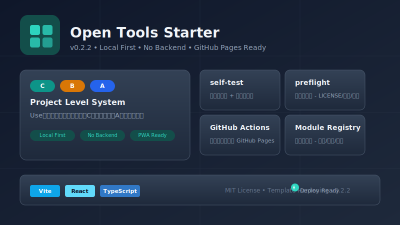

# Open Tools Starter

[](package.json)
[](LICENSE)
[]()
[]()
[]()
[]()
[]()
[]()

Open Tools Starter 是一个长期复用的 GitHub 开源项目母版，用来创建纯前端、Local First、Privacy Friendly 的 GitHub Pages 小工具项目。

它不是某个具体业务工具，而是一个可复制、可裁剪、可升级、可发布的模板地基。

## 在线演示

🔗 **在线访问**: https://w0nderful666.github.io/open-tools-starter/



## License

本项目采用 [MIT License](LICENSE)，可免费用于个人和商业项目。

## 适合做什么

- 文本处理工具
- 提示词生成器
- JSON / CSV 小工具
- PDF 或图片类纯前端工具
- 文件处理小工具
- 长期维护的前端工具箱

当前阶段只做模板复用机制，不实现 File Bento、PDF Desk Lite、Image Desk Lite，也不实现 PDF、图片处理、二维码、文件转换等具体业务功能。

## 为什么需要项目等级系统

纯前端小工具很容易从“一个按钮就够了”膨胀成“半个工具箱”。A / B / C 等级系统用来控制边界：

- 明确当前项目应该做到什么程度。
- 明确哪些模块必须保留。
- 明确哪些模块只是推荐或可选。
- 明确哪些模块在当前等级不建议加入。
- 让复制模板开新项目时有稳定标准。

详细说明见 [docs/PROJECT_LEVELS.md](docs/PROJECT_LEVELS.md)。

## C / B / A 怎么选择

| 等级 | 名称 | 适合项目 | 默认策略 |
| --- | --- | --- | --- |
| C | 轻量小工具 | 单页工具、文本处理、提示词生成器、小型计算器 | 快速发布，功能少但完整 |
| B | 标准实用工具 | PDF、图片、文件处理、JSON/CSV、字幕工具 | 补齐导入导出、下载、自测、发布说明 |
| A | 旗舰项目 | 长期维护工具箱、多模块产品 | 补齐 PWA、离线、批处理、组件库、preflight |

拿不准时先选 C。只有当真实需求出现时，再从 C 升到 B，或从 B 升到 A。

## Profile / Module Registry

第二阶段新增了两个配置源：

- `src/config/projectProfiles.ts`
- `src/config/moduleRegistry.ts`

`moduleRegistry.ts` 定义每个模块是什么，以及它在 C / B / A 中的状态：

- `required`
- `recommended`
- `optional`
- `not-recommended`

`projectProfiles.ts` 定义每个等级的：

- 适用场景
- 必须模块
- 推荐模块
- 可选模块
- 不建议模块
- 必要文档
- 必要检查
- 部署说明

首页的等级卡片、模块矩阵预览和当前等级模块列表都从这些配置读取。以后复制新项目时，优先改配置，而不是到页面里手动找硬编码。

## 如何复制这个模板开新项目

1. 复制整个项目目录。
2. 修改目录名和 `package.json`。
3. 填写 [docs/PROJECT_SPEC_TEMPLATE.md](docs/PROJECT_SPEC_TEMPLATE.md)。
4. 选择 C / B / A 等级。
5. 对照 [docs/MODULE_MATRIX.md](docs/MODULE_MATRIX.md) 裁剪模块。
6. 更新 `README.md` 和 `RELEASE_NOTES.md`。
7. 添加第一个真实工具。
8. 运行 build、self-test 和 preflight。

完整流程见 [docs/NEW_PROJECT_START_GUIDE.md](docs/NEW_PROJECT_START_GUIDE.md)。

## 本地运行

```bash
npm install
npm run dev
```

在当前 Windows PowerShell 环境中，如果 `npm` 被执行策略拦截，可以使用：

```bash
npm.cmd install
npm.cmd run dev
```

## 构建

```bash
npm run build
```

构建产物会输出到 `dist/`。

## self-test

命令行自测：

```bash
npm run self-test
```

浏览器自测：

```bash
npm run dev
```

然后打开：

```txt
http://localhost:5173/self-test.html
```

self-test 会检查页面加载、localStorage、主题切换、语言切换、A/B/C 等级卡片、模块矩阵区域、配置读取、复制按钮、下载按钮和关键 DOM 区域。

## preflight

轻量 preflight 用于发布前检查模板完整性：

```bash
npm run preflight
```

它会检查：

- 必要文档是否存在。
- Profile / Module Registry 是否存在。
- `package.json` 是否包含 build、self-test、preflight。
- 是否存在待办或修复标记。
- 源码中是否出现明显上传接口关键词。
- 是否存在硬编码 localhost 生产地址。

完整发布检查见 [docs/RELEASE_CHECKLIST.md](docs/RELEASE_CHECKLIST.md)。

## 如何填写项目规格模板

新项目启动前先复制并填写：

```txt
docs/PROJECT_SPEC_TEMPLATE.md
```

重点写清楚：

- 项目等级。
- 目标用户。
- 核心痛点。
- 核心功能。
- 不做什么。
- 是否需要文件处理、导入导出、分享链接、PWA、批处理。
- 隐私边界。
- 验收标准。

规格表没写清楚前，不建议开始大规模编码。

## GitHub Pages 部署

本项目的 Vite 配置使用：

```ts
base: "./"
```

这意味着构建后的资源使用相对路径，适合部署到任意 GitHub Pages 仓库路径。即使仓库名是 `open-tools-starter`，也优先保留 `base: "./"`：它不绑定具体仓库名，复制成新项目后不需要立刻修改部署路径；当前项目没有前端路由，相对路径对 GitHub Pages 子路径部署更稳。

推荐流程：

1. 推送代码到 GitHub。
2. 在仓库 Settings 中启用 GitHub Pages。
3. Source 选择 **GitHub Actions**。
4. push 到 `main` 分支，或在 Actions 页面手动运行 workflow。
5. workflow 会安装依赖、构建、运行 self-test、运行 preflight，并部署 `dist/`。

### GitHub Actions 自动部署

本项目包含：

```txt
.github/workflows/pages.yml
```

触发方式：

- push 到 `main` 分支。
- 在 GitHub Actions 页面使用 `workflow_dispatch` 手动触发。

workflow 做的事情：

1. 使用 `ubuntu-latest`。
2. 使用 `actions/checkout` 拉取代码。
3. 使用 `actions/setup-node@v4` 安装 Node.js 20，并启用 npm 缓存。
4. 如果存在 `package-lock.json`，运行 `npm ci`。
5. 如果不存在 `package-lock.json`，运行 `npm install`。
6. 运行 `npm run build`。
7. 运行 `npm run self-test`。
8. 运行 `npm run preflight`。
9. 使用 `actions/configure-pages` 配置 Pages。
10. 使用 `actions/upload-pages-artifact` 上传 `dist/`。
11. 使用 `actions/deploy-pages` 部署到 GitHub Pages。

GitHub Pages 设置路径：

```txt
Repository Settings -> Pages -> Build and deployment -> Source -> GitHub Actions
```

推送后检查：

```txt
Repository -> Actions -> Build and Deploy GitHub Pages
```

部署成功后，页面地址会出现在 workflow 的 `Deploy to GitHub Pages` 步骤和仓库 Pages 设置页中。

## 隐私原则

Open Tools Starter 默认遵守：

- Local First
- No Backend
- Privacy Friendly
- Offline Friendly
- GitHub Pages Ready

本模板不包含后端、数据库、登录系统或外部追踪脚本。后续项目处理用户文件时，应默认在浏览器本地完成，不上传到服务器。

## PWA 支持 (v0.2.0 新增)

v0.2.0 增加了轻量 PWA 能力：

- `public/manifest.webmanifest` - PWA 安装配置，包含名称、图标、主题色等。
- `public/icon.svg` - SVG 格式图标，可用于 PWA 图标。
- `public/sw.js` - Service Worker，使用版本化缓存 `open-tools-starter-v0.2.0`。
- `src/lib/registerServiceWorker.ts` - 在页面加载时注册 Service Worker。

Service Worker 只做轻量静态缓存，不做过度的离线逻辑。GitHub Pages 部署时，缓存策略优先保证页面可访问，不会因为旧缓存导致永久显示旧版本。

复制到新项目后记得更新：
- manifest 中的 `name`、`short_name`、`description`、`theme_color`
- sw.js 中的 `CACHE_NAME`

## SEO / OpenGraph (v0.2.0 新增)

`index.html` 已包含完整的 SEO 配置：

- `<title>`、`<meta name="description">`、`<meta name="keywords">`
- `<meta name="theme-color">`
- OpenGraph: `og:title`、`og:description`、`og:type`、`og:url`、`og:image`
- Twitter Card: `twitter:card`、`twitter:title`、`twitter:description`、`twitter:image`
- `<link rel="canonical">`

当前在线地址为：`https://w0nderful666.github.io/open-tools-starter/`

复制到新项目后记得更新这些 meta 标签。

## ErrorBoundary (v0.2.0 新增)

`src/components/ErrorBoundary.tsx` 捕获 React 运行时错误：

- 显示友好的错误状态，而非空白页面或控制台报错。
- 提供"刷新页面"按钮。
- 提供"复制错误摘要"按钮，用于调试。
- 错误 ID 使用简短时间戳格式，不泄露敏感环境信息。

App 根组件已包裹 ErrorBoundary，所有子组件错误都会被捕获。

## Template Health (v0.2.0 新增)

首页新增"模板健康度"区域，展示当前母版能力状态：

- GitHub Pages Ready
- Local First
- No Backend
- Privacy Friendly
- C/B/A Profiles
- Module Registry
- self-test
- preflight
- GitHub Actions
- PWA Ready
- SEO Ready
- ErrorBoundary

中英文切换时文案同步变化，深色模式下视觉正常，移动端不溢出。

## 复制到新项目后的 PWA / SEO 配置

复制模板开后，需要修改以下文件中的配置：

| 文件 | 需要修改的字段 |
|------|---------------|
| `package.json` | name, version, description |
| `index.html` | title, description, keywords, og:*, twitter:*, canonical |
| `public/manifest.webmanifest` | name, short_name, description, theme_color |
| `public/sw.js` | CACHE_NAME |
| `src/App.tsx` | localStorage key 前缀 |

详细清单见 `docs/COPY_TO_NEW_REPO_CHECKLIST.md`。

## 测试体系

本项目包含完整的自动化测试体系，用于验证模板质量。

### 测试脚本

| 脚本 | 功能 |
|------|------|
| `npm run self-test` | 命令行自测，验证构建产物和配置 |
| `npm run preflight` | 发布前检查，验证文档和敏感信息 |
| `npm run test:static` | 静态检查，验证 JS 语法和必要文件 |
| `npm run test:config` | 配置检查，验证 C/B/A 体系和模块注册 |
| `npm run test:docs` | 文档检查，验证必要文档和质量 |
| `npm run test:health` | 项目健康检查，验证必须文件和脚本完整性 |
| `npm run test:privacy` | 隐私边界检查，检测违规的外部 API 调用或敏感信息 |
| `npm run test:usability` | 模板可用性检查，验证复制新项目的便利性 |
| `npm run test:ui` | UI 合约检查，验证构建产物完整性 |
| `npm run test:dist` | 构建产物检查，验证 dist 目录 |
| `npm run test:pressure` | 压力测试，重复运行核心检查（默认3轮） |
| `npm run test:all` | 完整测试，覆盖 static/config/docs/health/privacy/usability/build/self-test/dist/ui/preflight |
| `npm run test:ci` | CI 链路测试，包含压力测试（2轮），与 GitHub Actions 一致 |

### 本地测试顺序

```bash
# 1. 静态检查
npm run test:static

# 2. 配置检查
npm run test:config

# 3. 文档检查
npm run test:docs

# 4. 项目健康检查
npm run test:health

# 5. 隐私边界检查
npm run test:privacy

# 6. 模板可用性检查
npm run test:usability

# 7. 构建
npm run build

# 8. 自测
npm run self-test

# 9. 构建产物检查
npm run test:dist

# 10. UI 合约检查
npm run test:ui

# 11. 发布前检查
npm run preflight

# 12. 完整测试
npm run test:all

# 13. CI 模拟测试（包含压力测试）
npm run test:ci

# 14. 单独压力测试（默认3轮）
npm run test:pressure
```

### 浏览器自测

```bash
# 启动开发服务器
npm run dev

# 打开浏览器访问
http://localhost:5173/self-test.html
```

### 压力测试

```bash
# 默认 3 轮
npm run test:pressure

# 自定义轮数
PRESSURE_ROUNDS=10 npm run test:pressure
```

### GitHub Actions

GitHub Actions 自动运行完整测试链路：

1. Install dependencies
2. Run static test
3. Run config test
4. Run docs test
5. Build
6. Run self-test
7. Run dist test
8. Run preflight
9. Run pressure test (2 rounds)
10. Deploy to GitHub Pages

任何一步失败都会阻止部署。

## 项目结构

```txt
docs/
  PROJECT_LEVELS.md
  MODULE_MATRIX.md
  OPENCODE_PRESETS.md
  NEW_PROJECT_START_GUIDE.md
  PROJECT_SPEC_TEMPLATE.md
  RELEASE_CHECKLIST.md
  TEMPLATE_MAINTENANCE.md
  COPY_TO_NEW_REPO_CHECKLIST.md
  VERSIONING_GUIDE.md
public/
  manifest.webmanifest
  icon.svg
  sw.js
  self-test.js
scripts/
  preflight.mjs
  run-self-test.mjs
.github/
  workflows/
    pages.yml
src/
  components/
    ErrorBoundary.tsx
    ...
  config/
    moduleRegistry.ts
    projectProfiles.ts
  hooks/
  i18n/
  lib/
    registerServiceWorker.ts
    storage.ts
    classNames.ts
  styles/
  App.tsx
  main.tsx
self-test.html
RELEASE_NOTES.md
README.md
```

## 推荐的新项目启动流程

1. 填写 `PROJECT_SPEC_TEMPLATE.md`。
2. 选择 C / B / A 等级。
3. 查看首页选中等级后的模块列表。
4. 裁剪 `moduleRegistry` 和 `projectProfiles`。
5. 更新 README、标题、项目名和 GitHub Pages base。
6. 添加第一个真实工具。
7. 运行 build、self-test、preflight。
8. 更新 RELEASE_NOTES。
9. 再考虑发布到 GitHub Pages。

## 当前未做内容

- 未实现 File Bento、PDF Desk Lite、Image Desk Lite 等具体项目。
- 未实现 PDF、图片处理、二维码、文件转换等业务工具。
- 未加入复杂批处理。
- 未引入后端、数据库、登录系统或用户文件上传。

## v0.3.0 规划

v0.2.0 完成后，母版已达到稳定状态。v0.3.0 可以开始第一个 C 级示例项目：

- 添加一个真实的轻量工具示例（如文本处理或提示词生成器）。
- 展示如何将模板变成可用的业务项目。
- 提供 README 模板供业务项目参考。
- 保持模板和示例分离，模板仍可用于创建其他项目。

详见 `docs/VERSIONING_GUIDE.md`。
